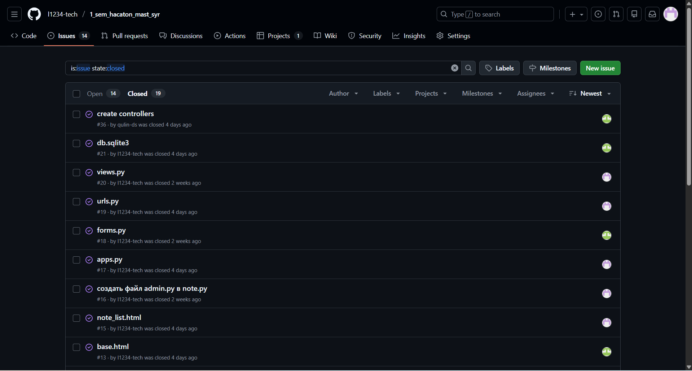
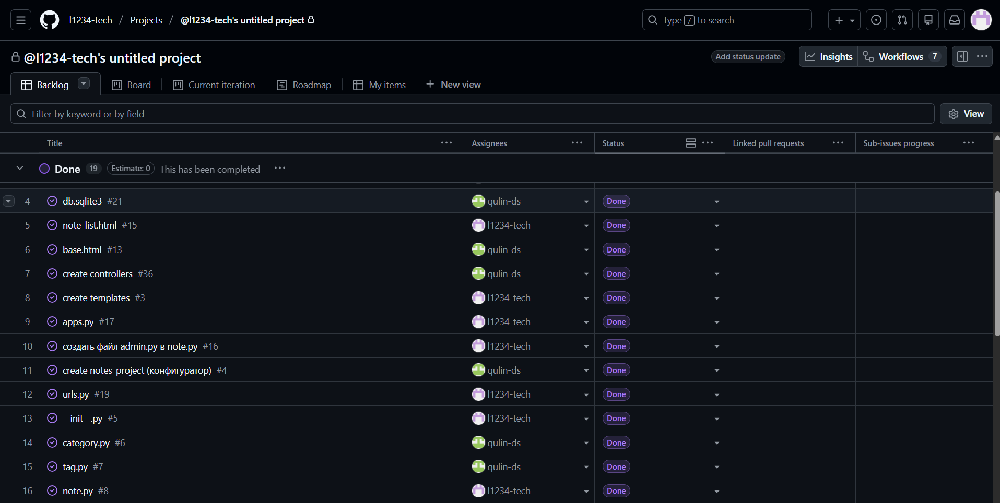
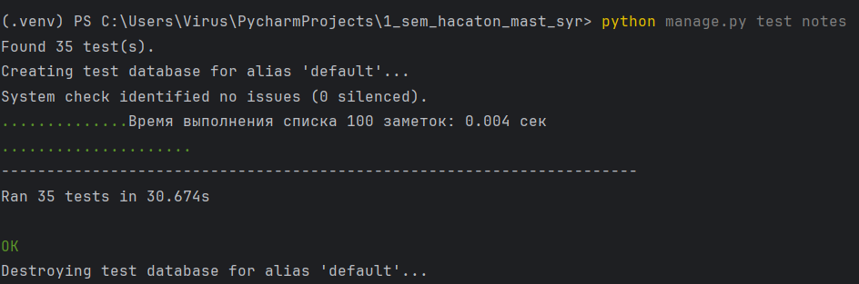

## Сырчин (501965) - Мастеров(501879)

---
# Django Notes App

## Описание проекта
    Это веб-приложение для управления заметками, разработанное на Django. 
    Приложение позволяет пользователям регистрироваться, создавать, 
    редактировать, просматривать и удалять свои заметки. 
    Все заметки приватны и доступны только их авторам.

## Основные функции
-  Регистрация и аутентификация пользователей
  -  Создание и редактирование заметок
    -  Поиск по заметкам
    -  Разделение заметок по стараницам (тэги для поиска нужных заметок)
    -  Интерфейс с Bootstrap 5
    -  Защита от CSRF атак
    -  Готовность к развертыванию на PythonAnywhere

## Технологический стек
- **Backend**: Django 4.2
- **Frontend**: HTML5, CSS3, JavaScript, Bootstrap 5
- **База данных**: SQLite3
- **Сервер**: Gunicorn + WhiteNoise
- **Хостинг**: PythonAnywhere готовность

## Структура проекта
     project/
       ├── config/ # Настройки Django проекта
       ├── notes/ # Основное приложение
       ├── static/ # Статические файлы (CSS, JS)
       ├── templates/ # Шаблоны HTML
       ├── .gitignore
       ├── db.sqlite3 # база данных
       ├── manage.py # Скрипт управления Django
       ├── README.md 
       ├── pythonanywhere_wsgi.py # работа с хостингом pythonanywhere
       └── requirements.txt # Зависимости

---

## Архитектура приложения (MVT - Model-View-Template)
### 1. Модели (Model)
**Что представляют: Структуру базы данных и бизнес-логику**

#### Файлы:

* #### `notes/models.py` - модели Note и Tag
* #### `notes/migrations/` - миграции для изменения структуры БД

### 2. Представления (View)
**Что представляют: Контроллеры, обрабатывающие HTTP-запросы**

#### Файлы:
* `_notes/views.py_` - все представления приложения
* `_notes/urls.py_` - маршрутизация URL

#### Типы представлений:

* `NoteListView` - список заметок пользователя
* `_NoteDetailView_` - детальный просмотр заметки
* `_NoteCreateView_` - создание новой заметки 
* `_NoteUpdateView_` - редактирование заметки 
* `_NoteDeleteView_` - удаление заметки 
* `_CustomLoginView_` - кастомная страница входа 
* `_note_search()_` - функция поиска заметок

### 3. Шаблоны (Template)
**Что представляют: HTML-разметку с Django Template Language**

#### Файлы:

* `templates/base.html` - базовый шаблон 
* `templates/notes/note_list.html` - список заметок 
* `templates/notes/note_detail.html` - детальная страница заметки 
* `templates/notes/note_form.html` - форма создания/редактирования 
* `templates/notes/note_confirm_delete.html` - подтверждение удаления 
* `templates/notes/login.html` - страница входа 
* `templates/notes/register.html` - страница регистрации

### 4. Статические файлы
#### Файлы:

* `static/css/style.css` - кастомные стили 
* `static/js/script.js` - JavaScript логика

---
## Особенности реализации

### Аутентификация и авторизация
- Пользовательская система регистрации и входа
- Сессии с защитой от CSRF
- Автоматическое перенаправление после аутентификации

### Модели данных
- Модель Note (Заметка) с полями: заголовок, содержание, даты создания/обновления, автор
- Связь Many-to-One с пользователем (один пользователь - много заметок)

### Безопасность
- Проверка прав доступа (пользователь видит только свои заметки)
- Валидация форм на стороне сервера и клиента
- Хеширование паролей и логинов

### Пользовательский интерфейс
- Уведомления о действиях пользователя
- Подтверждение критических действий (удаление)

----

## Работа в команде

### GitHub Flow
Проект разрабатывался в команде из двух человек с использованием **GitHub Flow**:

1. **Основная ветка**: `main` - всегда стабильная версия
2. **Ветки для разработки**: Каждая новая функция или исправление создавалась в отдельной ветке 
3. **Pull Requests**: Все изменения проходили ревью перед слиянием
4. **Issues**: Использовали систему задач для отслеживания прогресса

----
### Совместная работа
- Использовали **issues** для постановки задач и отслеживания багов
- Комментировали код для лучшего понимания
- Проводили код-ревью перед слиянием изменений
- Тестировали изменения локально перед отправкой PR

    Сырчин: templates, manage.py, models, hosts и другое.
    Мастеров: views, forms, urls, static, admin и другое.

### Используемые практики
- **Code Review**: Все Pull Request'ы проверялись напарником
- **Continuous Integration**: Тестирование перед слиянием
- **Documentation**: Комментарии в коде и документация функций
- **Commit Convention**: Семантические коммиты для лучшего отслеживания изменений
---
## Тестирование
### Запуск тестов:
`python manage.py test notes` 

### **Тесты покрывают:**

* Модели данных 
* Формы и валидацию 
* Представления и логику 
* Безопасность и авторизацию 
* Работу с базой данных

---

## Отчет о проекте

### О проекте
    Мы разработали полнофункциональное веб-приложение для управления заметками на Django. 
    Приложение следует принципам чистой архитектуры и включает все необходимые 
    функции для современного веб-приложения.

### Ключевые достижения:
1. **Полный цикл разработки**: От проектирования моделей до развертывания
2. **Безопасность**: Реализована защита от основных веб-уязвимостей
4. **Тестирование**: Покрытие всех основных компонентов тестами
5. **Готовность к продакшену**: Конфигурация для развертывания на PythonAnywhere

### Что удалось хорошо:
1. **Архитектура**: Чистое разделение ответственности между компонентами
2. **Безопасность**: Реализованы все основные меры защиты
3. **Код**: Читаемый, документированный, с хорошей структурой
4. **Интерфейс**: Современный и адаптивный дизайн
5. **Документация**: Полное описание проекта и инструкции

---

    Проект готов к использованию и может быть развернут как на локальном сервере, 
    так и на хостинге PythonAnywhere.

---
 
## PS
## Видеокаст с работой [проекта](https://drive.google.com/file/d/1XSwjQxoZb-Nl27O4gl6rnz4TuxkDkC4S/view?usp=sharing)